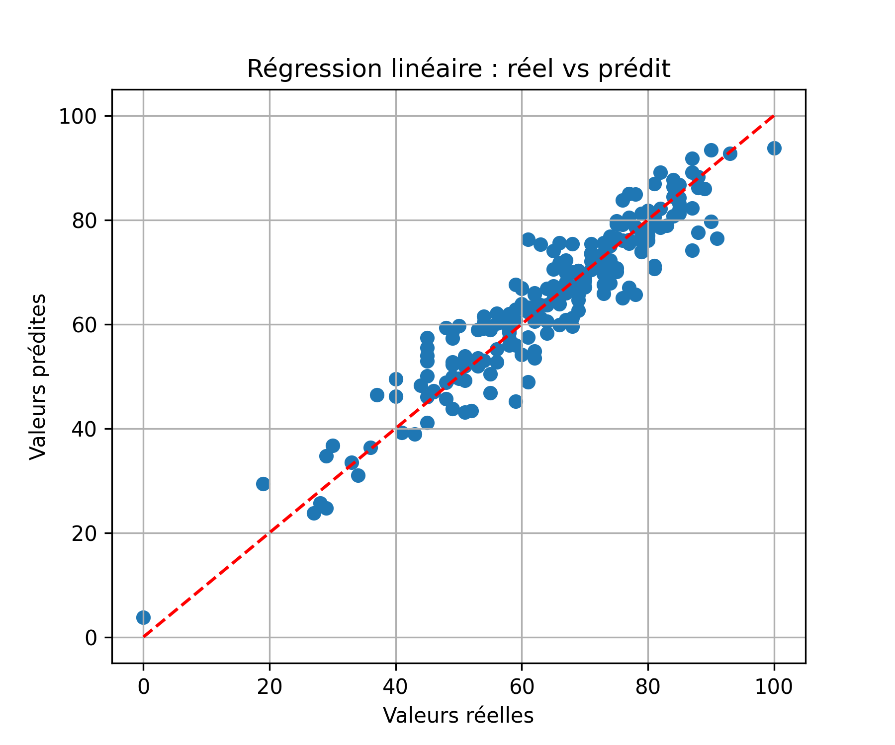
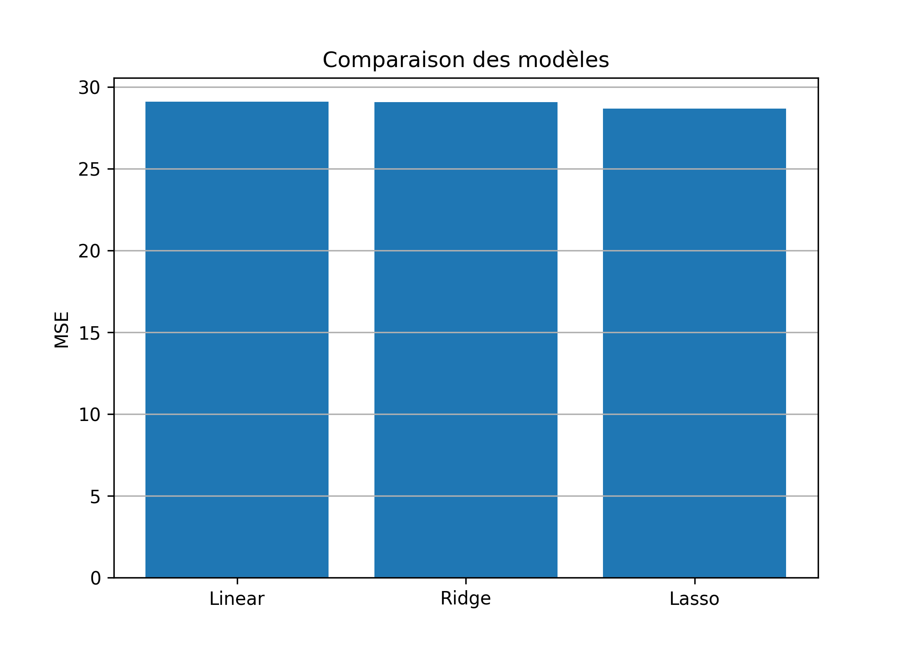
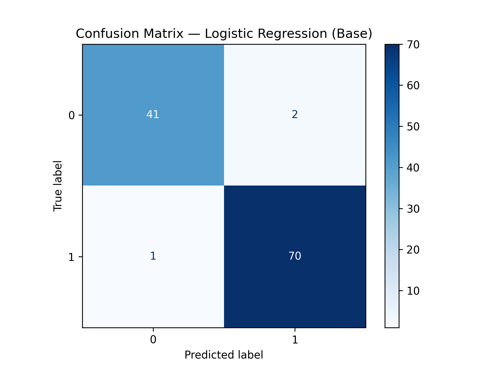
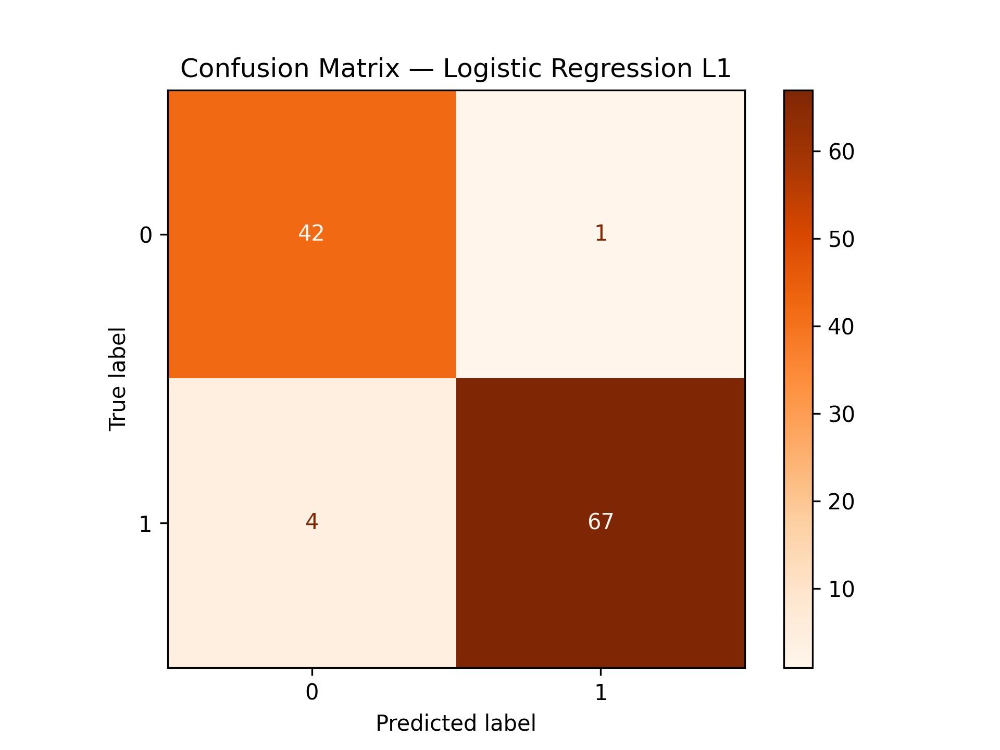
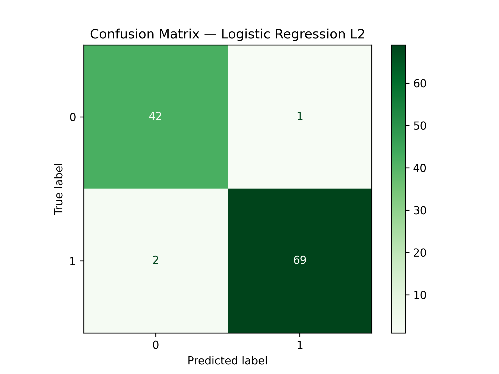

# Linear and Logistic Regression Analysis

## Project Overview
This project focuses on exploring and comparing **linear and logistic regression models** for predictive analysis.  
The main objectives are:  

- Understand the differences between regression types.  
- Evaluate the impact of **regularization (L1 & L2)** on model performance.  
- Analyze model results using real datasets.  

---

## Datasets Used

1. **Student Performance Dataset** (Kaggle)  
   - Features: gender, race/ethnicity, parental education, lunch, test preparation course, math, reading, writing scores.  
   - Objective: Predict `math score`.  
   - Dataset link: [Kaggle - Student Performance](https://www.kaggle.com/datasets/spscientist/students-performance-in-exams)  

 

2. **Breast Cancer Wisconsin Dataset** (scikit-learn)  
   - Features: 30 numeric attributes describing tumors.  
   - Target: Binary (`Malignant` or `Benign`)  

---

## Data Preprocessing
- Handling missing values and invalid entries.  
- Encoding categorical variables (one-hot encoding).  
- Standardization and normalization for model stability.  
- Removal of duplicates and irrelevant features.  

---

## Regression Analysis

### Linear Regression
- Predicting continuous variables (`math score`).  
- Regularization methods:  
  - **Ridge (L2)**: reduces overfitting by penalizing large coefficients.  
  - **Lasso (L1)**: performs feature selection by driving some coefficients to zero.  

**Results:**  
- Base Linear Regression: R² = 0.8804  
- Ridge: R² = 0.8805  
- Lasso: R² = 0.8822  

  

---

### Logistic Regression
- Predicting binary outcomes (diabetes, cancer diagnosis).  
- Regularization methods applied similarly (L1 & L2).  

**Breast Cancer Dataset:**  
- Accuracy: 97.37% (Base & L2), 95.61% (L1)  
- Confusion matrices and performance visualizations:  

 
     

---

## Key Findings
- **Linear regression** is effective for continuous data; **logistic regression** excels for classification tasks.  
- **Data cleaning and preprocessing** are critical for model stability and accurate predictions.  
- **Regularization** improves generalization:  
  - L1 encourages sparsity (feature selection).  
  - L2 stabilizes coefficients and prevents overfitting.  
- Performance metrics demonstrate the importance of choosing the appropriate regression type for the dataset.  

---

## Comparison Table

| Model | Type | Regularization | Performance |
|-------|------|----------------|------------|
| Linear Regression | Regression | None | R²=0.8804 |
| Ridge | Regression | L2 | R²=0.8805 |
| Lasso | Regression | L1 | R²=0.8822 |
| Logistic Regression | Classification | None | Accuracy=97.37% |
| Logistic L2 | Classification | L2 | Accuracy=97.37% |
| Logistic L1 | Classification | L1 | Accuracy=95.61% |

---

## Project Conclusion
This project demonstrates the application of regression techniques for both **continuous and categorical targets**.  
Data preprocessing, regularization, and careful selection of features are essential for achieving robust predictions.  
The results highlight the benefits of L1 and L2 regularization in controlling overfitting and improving model reliability.

---

## References
- [Student Performance Dataset](https://www.kaggle.com/datasets/spscientist/students-performance-in-exams)   
- [Scikit-learn Documentation](https://scikit-learn.org/stable/modules/linear_model.html)  
- [Breast Cancer Wisconsin Dataset](https://scikit-learn.org/stable/modules/generated/sklearn.datasets.load_breast_cancer.html)