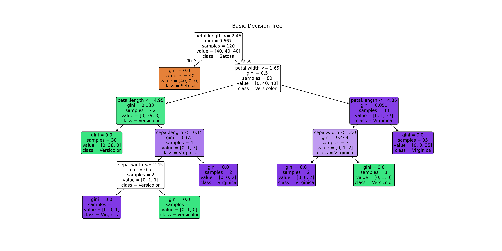
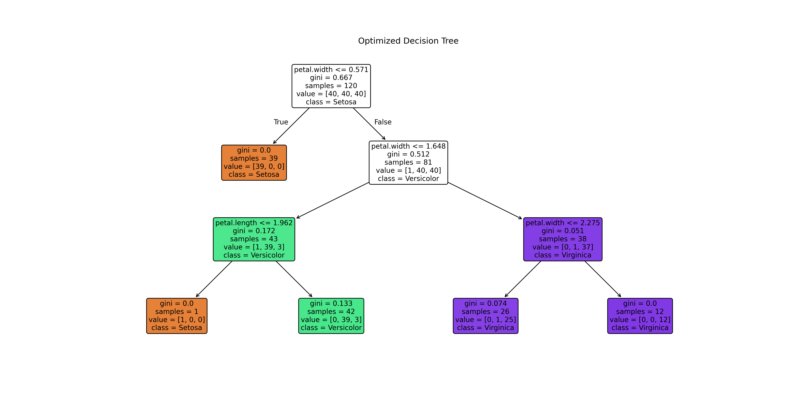
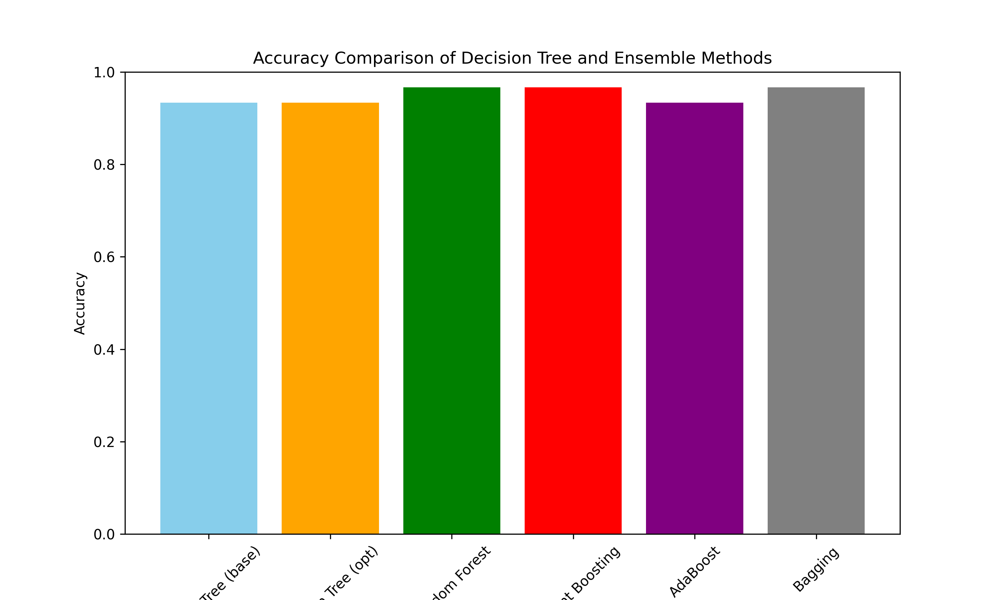

# Decision Trees and Ensemble Methods Analysis

## Project Overview
This project focuses on exploring and comparing **Decision Trees with Ensemble Learning Methods** for classification tasks.  
The main objectives are:  

- Understand how decision trees work and their limitations.  
- Evaluate the impact of **hyperparameter optimization** on tree performance.  
- Compare single trees with **ensemble methods** (Random Forest, Gradient Boosting, AdaBoost, Bagging).  
- Analyze model stability, accuracy, and generalization capabilities.  

---

## Dataset Used

**Iris Dataset**  
- Features: sepal length, sepal width, petal length, petal width (4 numerical features).  
- Target: Flower species (`Setosa`, `Versicolor`, `Virginica`)  
- Size: 150 samples (50 per class)  
- Challenge: Initially perfectly ordered by species, requiring proper shuffling.  

- Dataset link: [Iris dataset](https://archive.ics.uci.edu/ml/datasets/iris)

---

## Data Preprocessing
- **Shuffling**: Dataset randomly shuffled to prevent training bias.  
- **Stratified split**: 80/20 train-test split maintaining class proportions.  
- **No missing values**: Dataset is clean and ready for modeling.  

---

## Decision Tree Analysis

### Single Decision Tree
- Implemented with default and optimized hyperparameters.  
- Optimization using **GridSearchCV** with cross-validation.  
- Parameters tuned: `criterion`, `max_depth`, `min_samples_split`, `min_samples_leaf`, `splitter`.  


**Results:**  
- Base Decision Tree: Accuracy = 93.3%  
- Optimized Decision Tree: Accuracy = 93.3%  


### Tree Visualizations
  



### Depth Sensitivity Analysis
Testing the impact of tree depth on performance:  


**Key Finding**: Maximum accuracy reached at depth=2, remains stable until depth=6.  
This confirms that a shallow tree (depth=3) is sufficient for the Iris dataset.

---

## Ensemble Methods

### 1. Random Forest
- Bagging approach with multiple decision trees.  
- Reduces variance through averaging predictions.  
- **Result: Accuracy = 96.7%** ⭐  

### 2. Gradient Boosting
- Sequential learning correcting previous errors.  
- Reduces bias through iterative improvement.  
- **Result: Accuracy = 96.7%** ⭐  

### 3. AdaBoost
- Adaptive boosting focusing on misclassified samples.  
- Adjusts weights to emphasize difficult cases.  
- **Result: Accuracy = 93.3%**  

### 4. Bagging
- Bootstrap aggregating with multiple models.  
- Improves stability and reduces overfitting.  
- **Result: Accuracy = 96.7%** ⭐  


---

## Results Comparison

 
  


---

## Key Findings
- **Ensemble methods outperform single trees** by 3.4% (96.7% vs 93.3%).  
- **Random Forest, Gradient Boosting, and Bagging** achieve the best results.  
- **Hyperparameter optimization** has minimal impact on the simple Iris dataset.  
- **Depth analysis** shows shallow trees (depth=2-3) are sufficient for this data.  
- **Ensemble advantages**:  
  - Reduce variance (Random Forest, Bagging)  
  - Reduce bias (Gradient Boosting)  
  - Improve robustness and generalization  

---

## Performance Comparison Table

| Model | Accuracy | Performance Tier |
|-------|----------|------------------|
| Decision Tree (Base) | 93.3% | Good |
| Decision Tree (Optimized) | 93.3% | Good |
| Random Forest | **96.7%** | ⭐ Best |
| Gradient Boosting | **96.7%** | ⭐ Best |
| AdaBoost | 93.3% | Good |
| Bagging | **96.7%** | ⭐ Best |

---

## Mathematical Foundation

Decision trees use splitting criteria:

**Entropy:**  
```
H(S) = -Σ(pᵢ × log₂(pᵢ))
```

**Gini Impurity:**  
```
G(S) = 1 - Σ(pᵢ²)
```

**Information Gain:**  
```
Gain(S, A) = H(S) - Σ(|Sᵥ|/|S| × H(Sᵥ))
```

---

## Project Conclusion
This project demonstrates the power of **ensemble learning** over single decision trees.  
While individual trees are simple and interpretable, ensemble methods provide:  
- **Higher accuracy** (3.4% improvement)  
- **Better stability** through model aggregation  
- **Improved generalization** on unseen data  

The analysis shows that for the Iris dataset:  
- Hyperparameter tuning has minimal impact due to dataset simplicity.  
- Shallow trees (depth=2-3) are sufficient.  
- Ensemble methods consistently achieve superior performance.

---

## Technologies Used
- **Python 3.8+**  
- **scikit-learn**: Machine learning algorithms  
- **pandas**: Data manipulation  
- **numpy**: Numerical computing  
- **matplotlib**: Visualizations  

---

## References
- [Scikit-learn: Decision Trees](https://scikit-learn.org/stable/modules/tree.html)  
- [Scikit-learn: Ensemble Methods](https://scikit-learn.org/stable/modules/ensemble.html)  
- [Iris Dataset Documentation](https://scikit-learn.org/stable/datasets/toy_dataset.html#iris-dataset)  
