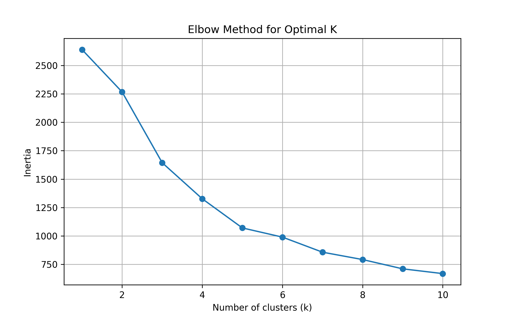

# Clustering Algorithms: Comparative Analysis for Customer Segmentation

## Project Overview
This project focuses on exploring and comparing **unsupervised clustering algorithms** for customer segmentation tasks.  
The main objectives are:  

- Understand how different clustering algorithms work and their strengths.  
- Implement and compare K-Means, Hierarchical Agglomerative, DBSCAN, and OPTICS clustering.  
- Determine the optimal number of clusters using Elbow Method and Silhouette Score.  
- Evaluate clustering quality using internal validation metrics.  
- Visualize and interpret clustering results using PCA projection.  

---

## Dataset Used

**Wholesale Customers Dataset** (UCI Machine Learning Repository)  
- Features: Annual spending on Fresh, Milk, Grocery, Frozen, Detergents_Paper, Delicassen (6 numerical features).  
- Removed variables: Channel and Region (to discover natural patterns without predefined categories).  
- Size: 440 observations representing wholesale customer purchasing behavior.  
- Challenge: Discovering natural customer segments without labeled data.  
- Dataset link: [UCI - Wholesale Customers](https://archive.ics.uci.edu/ml/datasets/Wholesale+customers)  


---

## Data Preprocessing
- **Variable removal**: Dropped Channel and Region to focus on pure purchasing behavior patterns.  
- **Standardization**: Applied StandardScaler to ensure all features contribute equally to distance calculations.  
- **No missing values**: Dataset is clean and ready for clustering algorithms.  

**Why standardization matters**: Clustering algorithms are distance-based, so features with larger scales (e.g., Grocery spending) would dominate if not normalized.

---

## Clustering Mathematical Foundation

**K-Means Objective Function:**  
```
J = Σᵢ₌₁ᵏ Σₓ∈Cᵢ ||x - μᵢ||²
```
Where μᵢ is the centroid of cluster Cᵢ. The algorithm minimizes within-cluster variance.

**K-Means Algorithm Steps:**  
1. Initialize k centroids (using k-means++ for better convergence)  
2. Assign each point to nearest centroid  
3. Recalculate centroids as mean of assigned points  
4. Repeat steps 2-3 until convergence  

---

## Determining Optimal Number of Clusters

### 1. Elbow Method

The Elbow Method plots inertia (sum of squared distances to nearest centroid) versus number of clusters k.




**Result**: The "elbow" appears at **k=3**, indicating that adding more clusters provides diminishing returns.

---

### 2. Silhouette Method

The Silhouette Score measures how similar a point is to its own cluster compared to other clusters.

**Silhouette Score range**: [-1, 1]  
- Close to 1: Well-clustered  
- Close to 0: On cluster boundary  
- Negative: Possibly wrong cluster  


**Result**: Maximum silhouette score achieved at **k=3**, confirming the elbow method.

**Conclusion**: Both methods converge on k=3 as the optimal number of clusters for this dataset.

---

## Clustering Algorithms Implementation

### 1. K-Means Clustering

**Implementation with optimal k=3:**


**Features:**  
- Initialization: k-means++ (improves convergence)  
- Number of clusters: 3  
- Output: Cluster centers representing average customer profiles  

**Advantages:**  
- Fast and efficient  
- Works well with spherical clusters  
- Easy to interpret centroids  

---

### 2. Hierarchical Agglomerative Clustering

Bottom-up approach that starts with each point as a cluster and iteratively merges the closest pairs.


**Features:**  
- Number of clusters: 3  
- Linkage: Ward (minimizes within-cluster variance)  
- Does not require initial centroid specification  

**Advantages:**  
- Captures hierarchical structure  
- Can handle non-spherical clusters  
- No need for random initialization  

---

### 3. DBSCAN (Density-Based Spatial Clustering)

Identifies clusters as high-density regions separated by low-density areas.


**Parameters:**  
- eps: 0.5 (maximum distance between two points to be neighbors)  
- min_samples: 5 (minimum points to form a dense region)  

**Features:**  
- Does not require specifying number of clusters  
- Can identify outliers as noise (label -1)  
- Discovers clusters of arbitrary shape  

**Advantages:**  
- Robust to outliers  
- Finds non-spherical clusters  
- Automatic noise detection  

---

### 4. OPTICS (Ordering Points To Identify Clustering Structure)

Extension of DBSCAN that does not require a fixed eps parameter.


**Parameters:**  
- min_samples: 5  
- xi: 0.05 (steepness threshold for cluster extraction)  
- min_cluster_size: 0.05  

**Features:**  
- Creates density-based ordering of points  
- Works with varying density clusters  
- More flexible than DBSCAN  

**Advantages:**  
- Handles clusters with different densities  
- No need to tune eps parameter  
- Provides reachability plot for analysis  

---

## Evaluation Metrics

### Internal Validation Metrics


**1. Silhouette Score** (higher is better):  
- Measures cohesion (how close points are within cluster)  
- Measures separation (how far clusters are from each other)  
- Range: [-1, 1], optimal ≈ 1  

**2. Davies-Bouldin Index** (lower is better):  
- Ratio of within-cluster to between-cluster distances  
- Range: [0, ∞), optimal ≈ 0  

**Why not ARI or Mutual Information?**  
These metrics require ground truth labels for comparison. Since this is unsupervised clustering without true labels, only internal metrics (Silhouette, Davies-Bouldin) are applicable.

---

## Results Comparison

### Performance Summary Table

| Method | Silhouette Score ↑ | Davies-Bouldin Index ↓ |
|--------|-------------------|------------------------|
| **K-Means** | **0.458** | **1.249** ⭐ |
| **Agglomerative** | 0.264 | 1.284 |
| **DBSCAN** | 0.195 | 1.579 |
| **OPTICS** | **0.569** ⭐ | 1.673 |

---

## Visual Analysis with PCA

PCA projection reduces 6 dimensions to 2 for visualization while preserving maximum variance.

.png)

**Key Observations:**  

1. **K-Means**: Shows three well-separated, compact clusters. Clean boundaries with minimal overlap.

2. **Agglomerative**: Similar structure to K-Means but with slightly less clear separation between clusters.

3. **DBSCAN**: Identifies dense regions and marks some points as noise (outliers). Fewer, larger clusters with irregular shapes.

4. **OPTICS**: Best separation according to silhouette score. Detects subtle density variations and complex cluster structures.

**Visual Confirmation**: The PCA projection confirms that k=3 is appropriate, as three natural groups are visible in the 2D space.

---

## Detailed Analysis by Method

### K-Means Performance
- **Silhouette**: 0.458 (good cluster separation)  
- **Davies-Bouldin**: 1.249 (best overall balance)  
- **Interpretation**: Provides stable, well-balanced clusters with clear centroids. Best for this dataset's structure.

### Agglomerative Performance
- **Silhouette**: 0.264 (moderate separation)  
- **Davies-Bouldin**: 1.284 (slightly worse than K-Means)  
- **Interpretation**: Captures hierarchical relationships but clusters are less distinct.

### DBSCAN Performance
- **Silhouette**: 0.195 (weak internal cohesion)  
- **Davies-Bouldin**: 1.579 (poor by this metric)  
- **Interpretation**: Detects noise effectively (useful for outlier detection) but standard metrics are penalized by noise points. Better for anomaly detection than pure segmentation.

### OPTICS Performance
- **Silhouette**: 0.569 (best cluster quality)  
- **Davies-Bouldin**: 1.673 (highest, but misleading)  
- **Interpretation**: Superior separation according to silhouette. Higher Davies-Bouldin due to noise detection. Excellent for complex density patterns.

---

## Key Findings

1. **Optimal cluster number**: Both Elbow and Silhouette methods confirm **k=3** as optimal for this dataset.

2. **Best overall method**: **K-Means** offers the most balanced performance with:  
   - Good silhouette score (0.458)  
   - Best Davies-Bouldin index (1.249)  
   - Stable and interpretable centroids  
   - Ideal for customer segmentation and analysis  

3. **Best separation**: **OPTICS** achieves highest silhouette (0.569) but with complexity trade-offs.

4. **Density-based methods**: DBSCAN and OPTICS identify outliers effectively but score lower on standard metrics due to noise detection. Valuable for anomaly detection.

5. **Hierarchical structure**: Agglomerative clustering captures relationships but provides less clear separation than K-Means.

6. **Standardization impact**: Critical for distance-based algorithms. Without scaling, high-value features (Grocery) would dominate the clustering.

7. **PCA validation**: Visual confirmation in 2D space supports k=3 choice and shows clear cluster structures.

---

## Practical Recommendations

**Use K-Means when:**  
- Need interpretable centroids for business insights  
- Working with spherical, well-separated clusters  
- Require fast computation for large datasets  
- Want stable, reproducible results  

**Use Agglomerative when:**  
- Need to understand hierarchical relationships  
- Want to try different numbers of clusters easily  
- Have non-spherical cluster shapes  

**Use DBSCAN when:**  
- Need to identify outliers/anomalies  
- Clusters have arbitrary shapes  
- Density varies but is relatively uniform within clusters  

**Use OPTICS when:**  
- Clusters have varying densities  
- Need flexibility without tuning eps  
- Want to analyze reachability patterns  

---

## Technologies Used
- **Python 3.8+**  
- **scikit-learn**: Clustering algorithms, evaluation metrics, PCA  
- **pandas**: Data manipulation  
- **numpy**: Numerical operations  
- **matplotlib & seaborn**: Visualizations  

---

## Project Conclusion

This project successfully demonstrated the application and comparison of four major clustering algorithms for customer segmentation. Through systematic analysis, we determined that:

- **Data preprocessing** (standardization) is crucial for distance-based algorithms.  
- **Multiple validation methods** (Elbow, Silhouette) provide robust cluster number selection.  
- **K-Means emerges as optimal** for this dataset due to its balanced performance, interpretability, and stability.  
- **Density-based methods** offer valuable outlier detection capabilities despite lower standard metric scores.  
- **Visualization with PCA** provides intuitive validation of clustering quality and structure.  

The three customer segments identified represent distinct purchasing behavior patterns, enabling targeted marketing strategies and inventory management decisions.

**Future improvements could include:**  
- Feature engineering (ratios, categories) for richer segmentation  
- Time-series clustering to capture seasonal patterns  
- Ensemble clustering combining multiple algorithms  
- Business validation with domain experts  

---

## References
- [UCI Machine Learning Repository - Wholesale Customers](https://archive.ics.uci.edu/ml/datasets/Wholesale+customers)  
- [Scikit-learn: Clustering](https://scikit-learn.org/stable/modules/clustering.html)  
