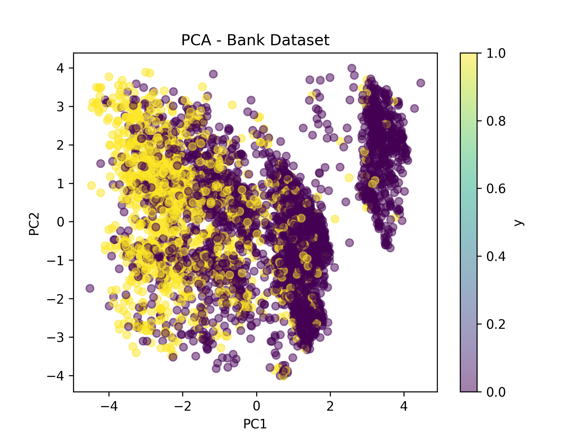
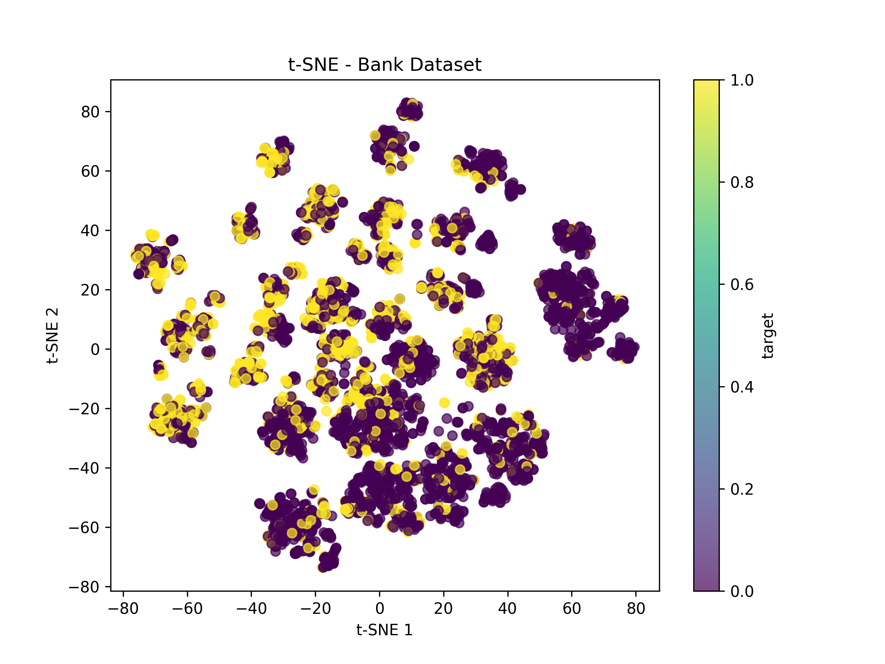
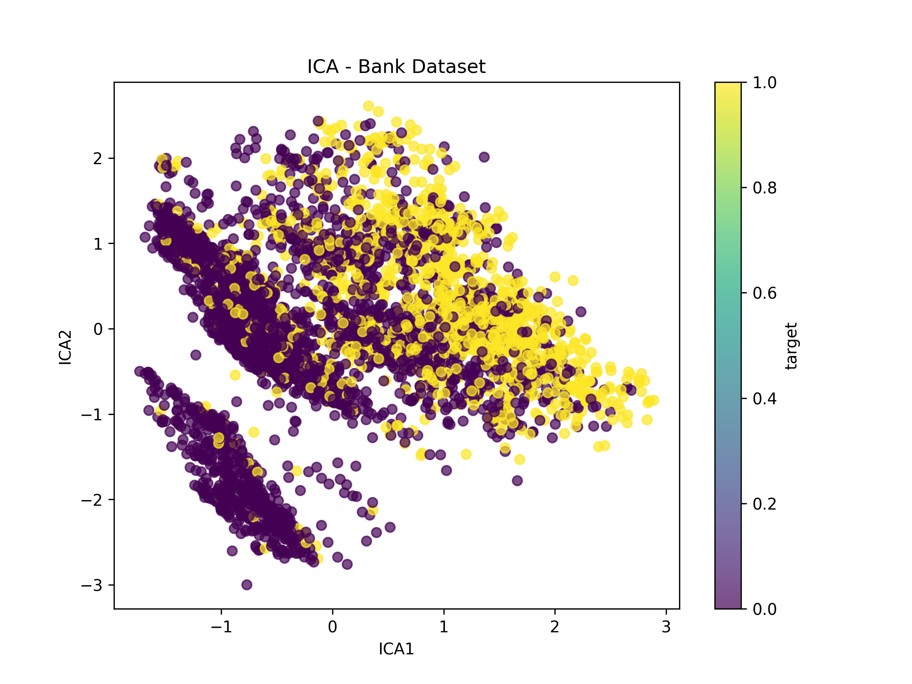
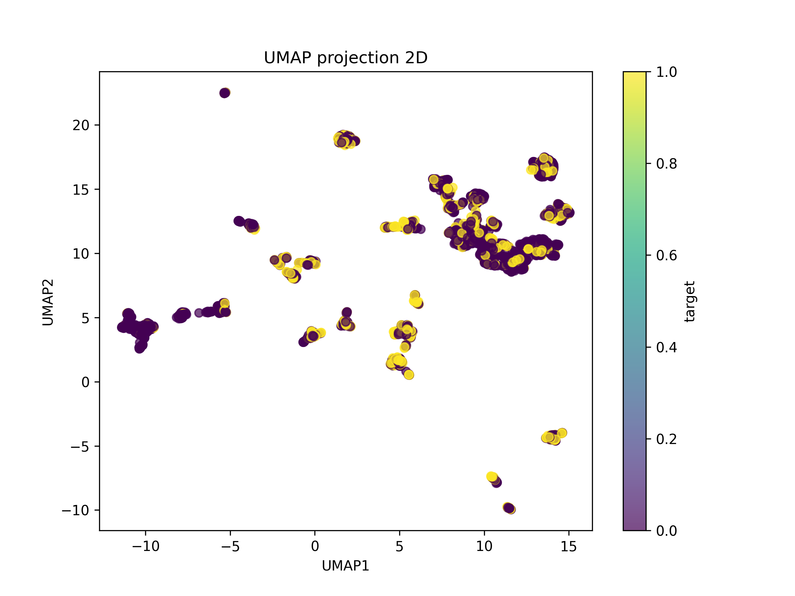

# Dimensionality Reduction: Comparative Analysis of PCA, LDA, t-SNE, ICA, and UMAP

## Project Overview
This project focuses on exploring and comparing **dimensionality reduction techniques** for data visualization and classification tasks.  
The main objectives are:  

- Understand how different dimensionality reduction methods work.  
- Apply and compare 5 techniques: PCA, LDA, t-SNE, ICA, and UMAP.  
- Visualize high-dimensional data in 2D space.  
- Evaluate the impact of dimensionality reduction on classification performance.  
- Analyze strengths and limitations of each method.  

---

## Dataset Used

**Bank Marketing Dataset** (UCI Machine Learning Repository)  
- Source: Bank direct marketing campaigns (phone calls)  
- Features: Age, job, marital status, education, balance, loan information, contact details, and more  
- Target: Binary classification - Did the client subscribe to a term deposit? (yes/no)  
- Size: 41,188 observations with mix of numerical and categorical features  
- Challenge: High-dimensional data with class imbalance  

---

## Data Preprocessing

### 1. Data Cleaning
- **Handling missing values**: Replaced "unknown" and "nonexistent" with NaN  
- **Removal**: Dropped rows with missing values  
- **Target encoding**: Mapped 'yes'→1, 'no'→0  

### 2. Feature Encoding
- **Numerical features**: Passed through unchanged  
- **Categorical features**: One-hot encoded with `drop='first'` to avoid multicollinearity  
- **Pipeline**: Used ColumnTransformer for automatic feature type detection  

### 3. Standardization
- Applied StandardScaler to all features  
- Critical for distance-based methods (PCA, t-SNE, ICA, UMAP)  
- Centers data to mean=0, scales to variance=1  

**Why standardization?** Without it, features with larger scales would dominate variance calculations and distance metrics, leading to biased results.

---

## Dimensionality Reduction Methods

### 1. PCA (Principal Component Analysis)

**Type**: Unsupervised, Linear  

**Principle**: Finds orthogonal directions that maximize variance in the data.

**Mathematical Foundation**:  
PCA solves eigenvalue decomposition of the covariance matrix to find principal components.

**Implementation**:
```python
from sklearn.decomposition import PCA
pca = PCA(n_components=2, random_state=42)
X_pca = pca.fit_transform(X_scaled)
```

**Advantages**:  
- Fast and computationally efficient  
- Linear and interpretable  
- Preserves global structure  
- Variance explained is quantifiable  

**Limitations**:  
- May not align with class separation  
- Assumes linear relationships  
- First components maximize variance, not discrimination  



---

### 2. LDA (Linear Discriminant Analysis)

**Type**: Supervised, Linear  

**Principle**: Maximizes separation between classes while minimizing within-class variance.

**Key Difference from PCA**: Uses label information to find discriminative directions.

**Implementation**:
```python
from sklearn.discriminant_analysis import LinearDiscriminantAnalysis
lda = LinearDiscriminantAnalysis(n_components=1)
lda.fit(X_train, y_train)
y_pred = lda.predict(X_test)
```

**Advantages**:  
- Excellent for classification (supervised)  
- Maximizes class separability  
- Can be used directly as a classifier  
- Optimal for linearly separable classes  

**Limitations**:  
- Requires labels (not for exploration)  
- Assumes Gaussian distributions  
- Maximum n_components = n_classes - 1  
- Sensitive to outliers  

---

### 3. t-SNE (t-Distributed Stochastic Neighbor Embedding)

**Type**: Unsupervised, Non-linear  

**Principle**: Preserves local neighborhood structure by minimizing divergence between high-dimensional and low-dimensional probability distributions.

**Implementation**:
```python
from sklearn.manifold import TSNE
tsne = TSNE(n_components=2, random_state=42, n_iter=1000, perplexity=30)
X_tsne = tsne.fit_transform(X_scaled)
```

**Advantages**:  
- Excellent for visualization  
- Reveals local cluster structure  
- Non-linear, captures complex patterns  
- Good for exploring hidden patterns  

**Limitations**:  
- Computationally expensive (O(n²))  
- Stochastic (results vary between runs)  
- Not designed for classification  
- Distances not meaningful  
- Sensitive to perplexity parameter  



---

### 4. ICA (Independent Component Analysis)

**Type**: Unsupervised, Linear  

**Principle**: Separates multivariate signal into additive, statistically independent components.

**Implementation**:
```python
from sklearn.decomposition import FastICA
ica = FastICA(n_components=2, random_state=42)
X_ica = ica.fit_transform(X_scaled)
```

**Advantages**:  
- Finds independent sources  
- Useful for signal separation (e.g., audio processing)  
- Can reveal hidden factors  
- Non-Gaussian component analysis  

**Limitations**:  
- Assumes statistical independence  
- Sensitive to initialization  
- Not optimized for classification  
- Interpretation can be difficult  



---

### 5. UMAP (Uniform Manifold Approximation and Projection)

**Type**: Unsupervised, Non-linear  

**Principle**: Constructs high-dimensional graph of nearest neighbors, then optimizes low-dimensional representation to preserve this structure.

**Implementation**:
```python
import umap
reducer = umap.UMAP(n_components=2, random_state=42)
X_umap = reducer.fit_transform(X_scaled)
```

**Advantages**:  
- Faster than t-SNE  
- Preserves both local AND global structure  
- Scalable to large datasets  
- Better for pre-processing before classification  
- Deterministic with fixed random_state  

**Limitations**:  
- Relatively new method  
- More parameters to tune than PCA  
- Can create artificial clusters  
- Less interpretable than PCA  



---

## Classification Performance

### Methodology

**Classifier**: Logistic Regression  
- Simple and interpretable baseline  
- Works well with linearly separable data  
- Fast training  
- Provides probability estimates  

**Evaluation**: Train/test split (80/20) with stratification  
- Ensures class proportions maintained  
- Metrics: Accuracy, Confusion Matrix, Precision, Recall, F1-Score  

### Results Summary

| Method | Accuracy | Type | Dimensions | Comment |
|--------|----------|------|------------|---------|
| **Full Features (Standardized)** | **0.84** | - | Original | Baseline with all information |
| **PCA (2 comp.)** | 0.80 | Linear, Unsupervised | 2 | Some information loss |
| **LDA (1 comp.)** | 0.80 | Linear, Supervised | 1 | Good class separation |
| **t-SNE (2 comp.)** | 0.73 | Non-linear, Unsupervised | 2 | Not designed for classification |
| **ICA (2 comp.)** | 0.80 | Linear, Unsupervised | 2 | Depends on independence assumption |
| **UMAP (2 comp.)** | 0.72 | Non-linear, Unsupervised | 2 | Better for visualization than classification |

---

## Detailed Analysis

### Performance Interpretation

**1. Full Features (84% accuracy)**:  
- Baseline performance with all available information  
- Shows that the problem is moderately difficult  
- Sets upper bound for reduced-dimension methods  

**2. PCA, LDA, ICA (80% accuracy)**:  
- Only 4% accuracy drop despite massive dimension reduction  
- **PCA**: Loses some discriminative information focusing on variance  
- **LDA**: Maintains good performance by targeting class separation  
- **ICA**: Performs well if independence assumption holds  

**3. t-SNE and UMAP (72-73% accuracy)**:  
- Significant accuracy drop  
- **Why?** These methods prioritize visualization over classification  
- Non-linear transformations may distort decision boundaries  
- Local structure preservation doesn't guarantee global separability  
- **Best use**: Data exploration, not pre-processing for classification  

---

## Strengths and Limitations Summary

### PCA
✅ **Strengths**: Fast, interpretable, quantifiable variance explained, reversible  
❌ **Limitations**: Linear only, may miss class-discriminative directions  

### LDA
✅ **Strengths**: Optimal for classification, maximizes class separation, can be used as classifier  
❌ **Limitations**: Requires labels, assumes Gaussian distributions, limited components  

### t-SNE
✅ **Strengths**: Beautiful visualizations, reveals hidden clusters, captures non-linear patterns  
❌ **Limitations**: Slow, stochastic, not for classification, sensitive to parameters  

### ICA
✅ **Strengths**: Finds independent sources, good for signal processing  
❌ **Limitations**: Assumes independence, sensitive initialization, hard to interpret  

### UMAP
✅ **Strengths**: Fast, preserves local+global structure, scalable, deterministic  
❌ **Limitations**: Many parameters, can create artifacts, less interpretable  

---

## Practical Recommendations

**Choose PCA when:**  
- Need fast, interpretable dimensionality reduction  
- Want to understand variance distribution  
- Preprocessing for linear classifiers  
- Need to inverse transform back to original space  

**Choose LDA when:**  
- Classification is the primary goal  
- Have labeled data  
- Classes are approximately linearly separable  
- Want built-in classification capability  

**Choose t-SNE when:**  
- Exploratory data analysis and visualization  
- Discovering hidden cluster structures  
- Presentation and communication  
- Dataset size is manageable (< 10,000 samples)  

**Choose ICA when:**  
- Dealing with mixed signal sources  
- Need statistically independent components  
- Working on audio/EEG/signal processing  

**Choose UMAP when:**  
- Need visualization of large datasets (> 10,000 samples)  
- Want better global structure than t-SNE  
- Faster alternative to t-SNE  
- May use as preprocessing (with caution)  

---

## Key Findings

1. **Dimensionality reduction trade-off**: Reducing from full features to 2D causes 4-12% accuracy drop, but enables visualization and faster computation.

2. **Supervised vs Unsupervised**: LDA (supervised) maintains 80% accuracy with just 1 dimension, matching PCA's 2-component performance.

3. **Visualization ≠ Classification**: t-SNE and UMAP excel at visualization but aren't optimal for classification preprocessing.

4. **Linear methods perform well**: PCA, LDA, ICA all achieve 80% accuracy, suggesting the data has strong linear separability.

5. **Standardization is critical**: All methods require properly scaled features for optimal performance.

6. **Method selection matters**: The right choice depends on your goal (visualization, classification, signal separation, speed).

---

## Technologies Used
- **Python 3.8+**  
- **scikit-learn**: PCA, LDA, t-SNE, ICA, preprocessing, classification  
- **umap-learn**: UMAP implementation  
- **pandas**: Data manipulation  
- **numpy**: Numerical operations  
- **matplotlib**: Visualizations  

---

## Project Conclusion

This project demonstrated the application and comparison of five major dimensionality reduction techniques on a real-world bank marketing dataset. Key takeaways:

1. **Different goals require different methods**: PCA/LDA for classification, t-SNE/UMAP for visualization, ICA for signal separation.

2. **Supervised methods win for classification**: LDA's 80% accuracy with 1 component shows the power of using label information.

3. **Visualization methods have trade-offs**: t-SNE and UMAP create beautiful plots but sacrifice classification accuracy.

4. **Linear methods are underrated**: PCA, LDA, and ICA all perform well, suggesting linear separability in this dataset.

5. **Preprocessing matters**: Proper data cleaning, encoding, and standardization are crucial for all methods.

**Best practice workflow**:  
1. Start with **PCA** to understand variance distribution  
2. Use **t-SNE or UMAP** for exploratory visualization  
3. Apply **LDA** if you have labels and need classification  
4. Test **full features** as baseline before reducing dimensions  
5. Always standardize data first  

The 4-12% accuracy cost of dimension reduction is often worthwhile for the gains in speed, visualization, and interpretability—but always measure the trade-off for your specific use case.

---

## References
- [UCI Machine Learning Repository - Bank Marketing](https://archive.ics.uci.edu/ml/datasets/bank+marketing)  
- [Scikit-learn: Dimensionality Reduction](https://scikit-learn.org/stable/modules/decomposition.html)  
- [UMAP Documentation](https://umap-learn.readthedocs.io/)  
