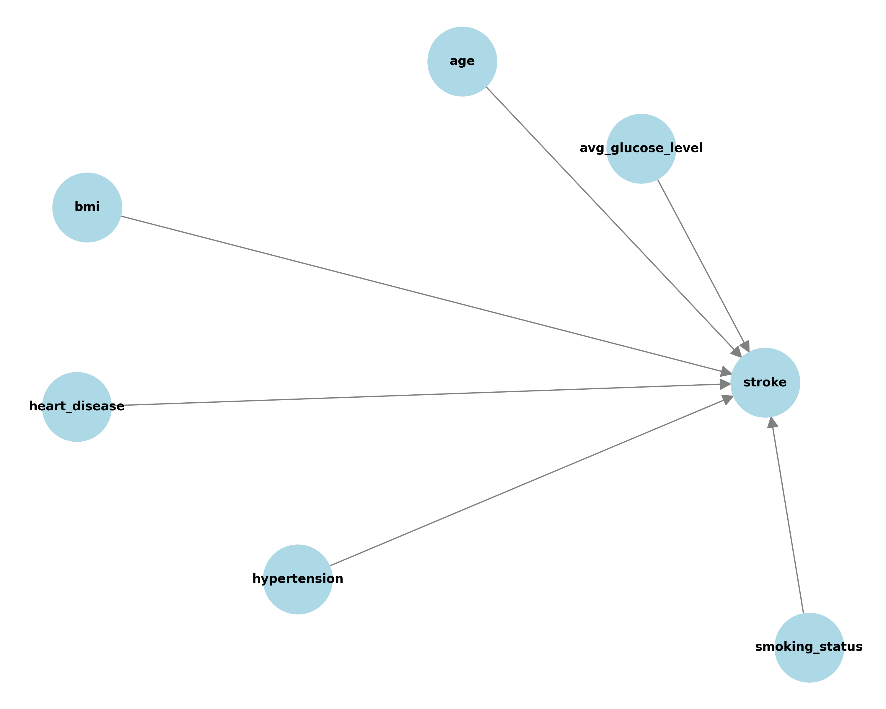

# Bayesian Networks for Stroke Risk Prediction

## Project Overview
This project focuses on applying **Bayesian Networks** to model probabilistic relationships between risk factors and stroke occurrence.  
The main objectives are:  

- Understand how Bayesian Networks represent conditional dependencies.  
- Build a probabilistic graphical model for stroke prediction.  
- Learn Conditional Probability Distributions (CPDs) from medical data.  
- Perform probabilistic inference to estimate stroke risk given evidence.  
- Analyze the causal relationships between risk factors and stroke.  

---

## Dataset Used

**Stroke Prediction Dataset**  
- Features: Gender, Age, Hypertension, Heart Disease, Average Glucose Level, BMI, Smoking Status  
- Target: Binary classification - Did the patient have a stroke? (0/1)  
- Size: Medical records with demographic and health indicators  
- Challenge: Class imbalance (stroke is rare event ~5%)  

**Feature Preprocessing**:
- **Age**: Discretized into 3 categories (Young, Middle, Old)  
- **BMI**: Discretized into 3 categories (Normal, Overweight, Obese)  
- **Glucose**: Discretized into 3 categories (Low, Medium, High)  
- **Categorical**: Gender, Hypertension, Heart Disease, Smoking Status  


---

## Bayesian Networks Foundation

### What is a Bayesian Network?

A Bayesian Network is a **probabilistic graphical model** that represents:
- **Nodes**: Random variables (risk factors, stroke)  
- **Edges**: Conditional dependencies between variables  
- **CPDs**: Conditional Probability Distributions quantifying relationships  

### Mathematical Foundation

**Joint Probability Factorization**:  
```
P(X₁, X₂, ..., Xₙ) = ∏ᵢ P(Xᵢ | Parents(Xᵢ))
```

**Conditional Independence**:  
Given parents, each node is independent of its non-descendants.

**Inference via Bayes' Theorem**:  
```
P(A|B) = P(B|A) × P(A) / P(B)
```

---

## Network Structure

### Architecture: Naive Bayes Structure

All risk factors independently contribute to stroke probability:



**Edges (Dependencies)**:
- `age → stroke`  
- `hypertension → stroke`  
- `heart_disease → stroke`  
- `avg_glucose_level → stroke`  
- `bmi → stroke`  
- `smoking_status → stroke`  

**Why this structure?**  
- Medically plausible: Each risk factor independently affects stroke risk  
- Computationally efficient: No complex inter-dependencies  
- Interpretable: Clear cause-effect relationships  
- Naive Bayes assumption: Conditionally independent given stroke  

---

## Learned Parameters (CPDs)

### Unconditional Probabilities (Root Nodes)

**Age Distribution**:
| Category | Probability |
|----------|-------------|
| Young    | 27.6%       |
| Middle   | 37.6%       |
| Old      | 34.8%       |

**Hypertension**:
| Status | Probability |
|--------|-------------|
| No (0) | 90.3%       |
| Yes (1)| 9.7%        |

**Heart Disease**:
| Status | Probability |
|--------|-------------|
| No (0) | 94.6%       |
| Yes (1)| 5.4%        |

**Glucose Level**:
| Category | Probability |
|----------|-------------|
| Low      | 81.3%       |
| Medium   | 10.1%       |
| High     | 8.6%        |

**BMI**:
| Category   | Probability |
|------------|-------------|
| Normal     | 91.2%       |
| Overweight | 8.7%        |
| Obese      | 0.08%       |

**Smoking Status**:
| Category         | Probability |
|------------------|-------------|
| Never smoked     | 37.0%       |
| Unknown          | 30.2%       |
| Formerly smoked  | 17.3%       |
| Smokes           | 15.4%       |

---

## Probabilistic Inference

### Case 1: Elderly Person with Hypertension

**Evidence**:  
- Age = Old  
- Hypertension = Yes  

**Query**: What is P(Stroke | Age=Old, Hypertension=Yes)?

**Result**:
| Outcome | Probability |
|---------|-------------|
| No Stroke (0) | **85.9%** |
| Stroke (1)    | **14.1%** |

**Interpretation**:  
Being elderly with hypertension increases stroke risk to **14.1%**, which is **~3x higher** than the baseline stroke rate (~5%). This is a high-risk profile requiring medical attention.

---

### Case 2: Smoker with High Glucose

**Evidence**:  
- Smoking Status = Smokes  
- Average Glucose Level = High  

**Query**: What is P(Stroke | Smoking=Yes, Glucose=High)?

**Result**:
| Outcome | Probability |
|---------|-------------|
| No Stroke (0) | **92.6%** |
| Stroke (1)    | **7.5%** |

**Interpretation**:  
This combination leads to a **7.5%** stroke risk, which is **~1.5x higher** than baseline. While elevated, it's lower than the elderly + hypertension case, suggesting age and hypertension are stronger predictors.

---

## Key Findings

1. **Age + Hypertension = Highest Risk**: The combination of being elderly with hypertension yields **14.1% stroke probability**, the highest risk profile tested.

2. **Age is a strong predictor**: The elderly category (34.8% of population) shows significantly elevated risk when combined with other factors.

3. **Hypertension prevalence**: 9.7% of the population has hypertension, which is medically consistent with real-world data.

4. **Multiple risk factors compound**: Having 2+ risk factors substantially increases stroke probability compared to single factors.

5. **Smoking + High Glucose = Moderate Risk**: At 7.5%, this combination is concerning but less severe than age + hypertension.

6. **BMI distribution issue**: Only 0.08% classified as obese suggests discretization thresholds may need adjustment.

7. **Missing data**: 30.2% "Unknown" smoking status indicates data quality issues that could affect model accuracy.

---

## Medical Interpretation

### Risk Stratification

**High Risk (>10%)**:
- Elderly patients with hypertension  
- Likely: Elderly + heart disease  
- Likely: Multiple comorbidities  

**Moderate Risk (5-10%)**:
- Smokers with high glucose  
- Middle-aged with hypertension  
- Any combination of 2 risk factors  

**Low Risk (<5%)**:
- Young, healthy individuals  
- No major risk factors  

### Clinical Insights

1. **Age matters most**: Being in the "Old" category dramatically increases risk regardless of other factors.

2. **Hypertension amplifies risk**: When combined with age, it triples stroke probability.

3. **Glucose control is important**: High glucose combined with smoking creates elevated risk.

4. **Preventive care targets**: Focus on elderly populations with hypertension for stroke prevention programs.

---


## Technologies Used
- **Python 3.8+**  
- **pgmpy**: Bayesian Network modeling and inference  
- **pandas**: Data preprocessing  
- **numpy**: Numerical operations  
- **networkx**: Graph visualization  
- **matplotlib**: Plotting  

---

## Project Conclusion

This project successfully demonstrated the application of **Bayesian Networks** for stroke risk prediction. Key takeaways:

1. **Probabilistic modeling is powerful**: Bayesian Networks naturally handle uncertainty and provide interpretable probability estimates.

2. **Age and hypertension are critical**: These two factors, especially in combination, dramatically increase stroke risk (14.1%).

3. **Multiple risk factors compound**: Stroke risk increases non-linearly with the number of risk factors present.

4. **Explainability matters**: Unlike black-box models, Bayesian Networks show clear causal pathways, making them ideal for medical applications.

5. **Data quality is crucial**: Issues like 30% missing smoking data and skewed BMI distributions affect model reliability.


## References
- pgmpy Documentation: [https://pgmpy.org/](https://pgmpy.org/)  
